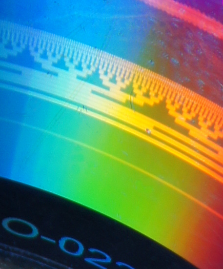
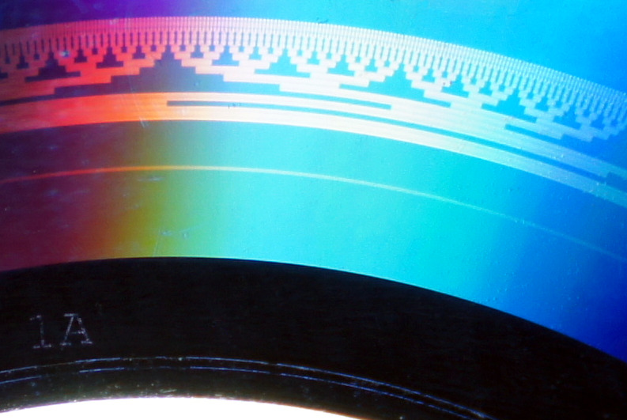

# MrBurns
Open source DiskT@2 (LabelFlash) dvd surface graphics burner. Allows to burn concentric bitmap images(only predefined gray code pattern atm) on a DVD disk's working surface with compatible drives. Initially was developed to print Gray code patterns for high precision angular measurment.

# Sic!
It burnz imagez on dizkz with IR LAZER BEAMZ (jEEZ!).

# Result
13 Bits of Gray DVD.

It's exactly 8192 steps per revolution. Not bad, huh?

